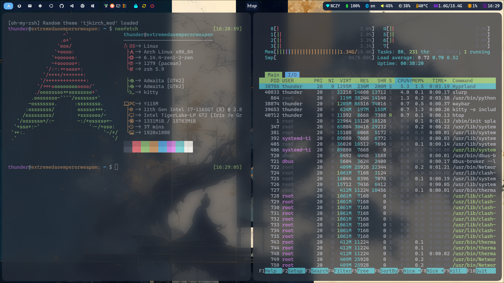
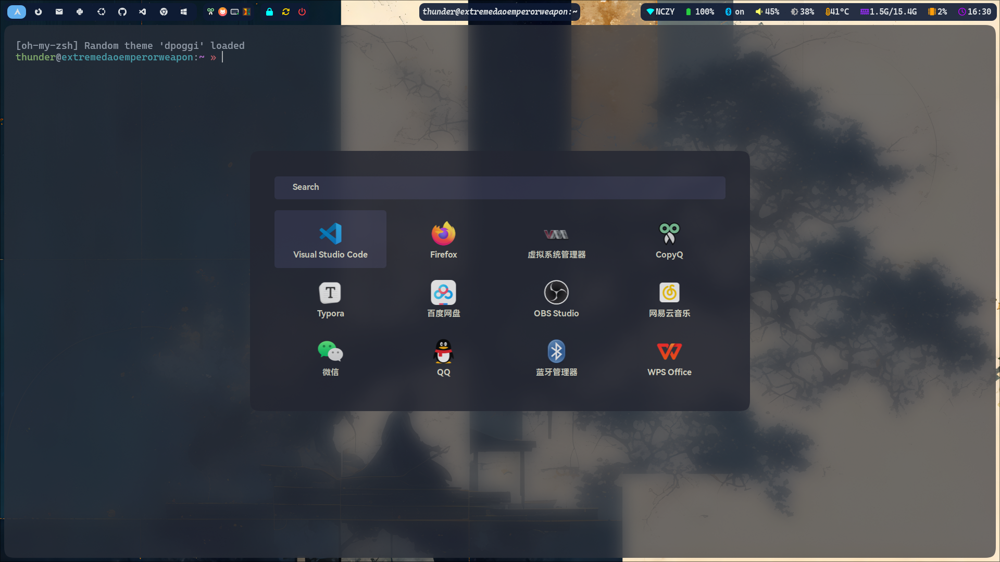
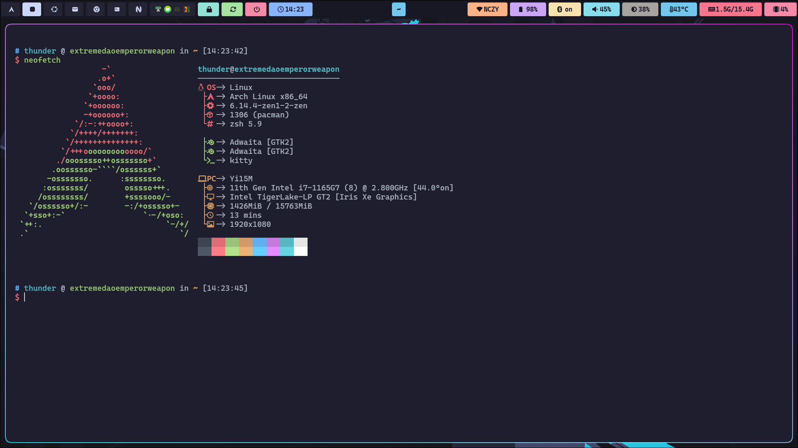
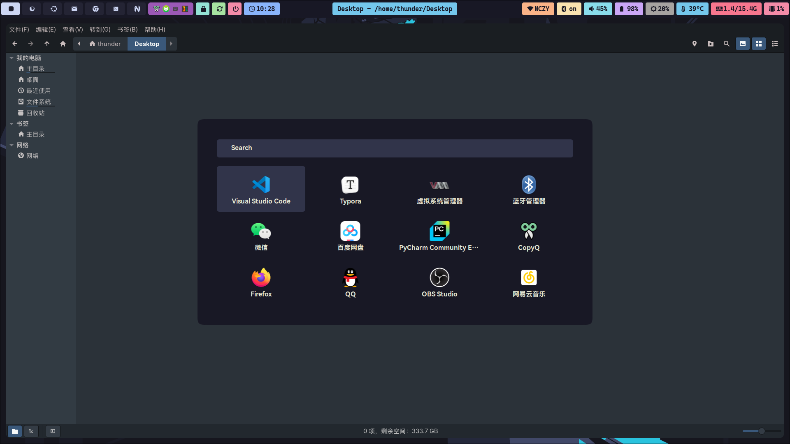

# hyprland-dotfiles

个人 hyprland 配置

[grub 主题下载地址](https://www.gnome-look.org/browse?cat=109)

[光标主题下载地址](https://www.gnome-look.org/browse?cat=107&ord=latest)

[Plymouth 系统加载动画](https://github.com/adi1090x/plymouth-themes)

[neofetch 主题](https://github.com/Chick2D/neofetch-themes)

[rime 输入法](https://github.com/wongdean/rime-settings)

[rofi 主题](https://github.com/yuky2020/rofi-themes)

style2 的 waybar 在 [这位大佬](https://github.com/sameemul-haque/dotfiles) 的基础上做了修改

## Style1

## Style2

